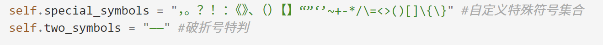
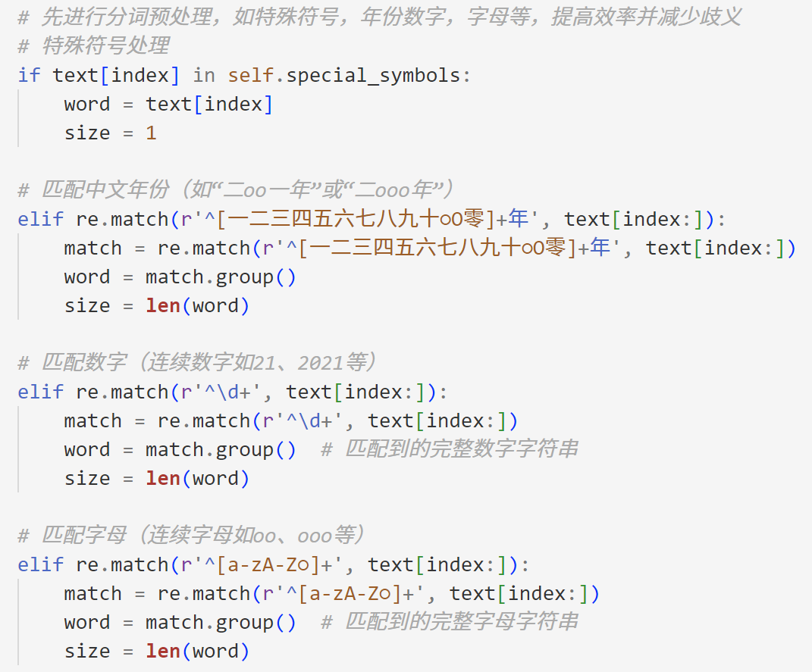
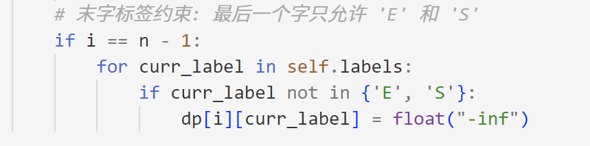

# 实验报告

## ① 采用的算法及是否有改进  
在本项目中，使用了以下几种分词算法：  
1. **前向最大匹配（FMM）**：通过从左到右逐一匹配最大长度的词语实现分词。该方法计算简单且效率高，但可能存在歧义问题。  
2. **反向最小匹配（RMinM）**：从右到左匹配最短词语实现分词。与FMM方法类似，但有时可以更好地处理特定场景中的歧义问题。  
3. **基于隐马尔可夫模型（HMM）的分词**：利用概率统计方法，即通过统计传递概率和状态特征概率，训练模型解决词语边界的判定问题，改进了机械分词方法。在分词时，即用Viterbi动态规划方法从第二个字开始寻找最优路径。  
4. **条件随机场（CRF）分词**：通过更复杂的特征表示和序列标注，如前后字，字符类型等，提高了分词效果，尤其在解决未登录词和歧义词时有显著优势。  

算法改进：
1. 使用pku_test.txt进行机械分词测试时，我发现机械分词可以处理单个标点符号（因为无法匹配词典会视为单字），但对于破折号“——”，这个长度为2的中文符号，机械分词会将其分为两个‘-’，而在gold_standard里面应该是将其视为一个词，因此我在机械分词中进行了符号的预处理。
2. 此外，对于数字，年份，我也进行了预处理，具体的测试用例可以在mini_test.py中看到。
3. 对于HMMSegmenter，我曾经尝试仿照CRF中的bigram，将prev_word和next_word也作为特征来计算状态特征概率（原来是label和word相对应的unigram），但是最后的训练结果不是很理想，在test.py的结果中，准确度比初始更低。因此，我最后保留了原来的状态特征概率计算方式，相关的改进代码，可以在历史版本中看到。
4. 在测试中，我发现HMMSegmenter对于首尾字的标签判断会出现不符合规则的情况，因此在Viterbi算法中加入了首尾字的标签限制，如图：
5. 对于不同的分词器，我都统一了分词接口`Segment()`，以及其他内部接口也进行了对应统一。

---

## ② 能解决什么类型的分词问题  
1. **基本分词**：对于一般句子，带有预处理的机械分词已经可以较好地应对。
2. **歧义问题**：利用统计学习模型（HMM、CRF）引入上下文信息，减少因歧义词语导致的分词错误。  
3. **未登录词**：通过训练BMES（Begin、Middle、End、Single）标签模型，能够有效识别未登录词，提高分词的准确性。

---

## ③ 主要的函数  
1. `segment()`：统一分词接口，支持多种分词方法（FMM、RMinM、HMM、CRF）。输入为多行字符串sentences，输出是一个元素为分词字符串的list。
2. `generate_bmes()`：在`generate.py`文件中，可以读取分好词的标准文件，生成BMES标注训练数据（详情可见bmes_train_pku.txt），支持模型训练。  
3. `test()`：运行文件分词测试，通过准确率，召回率和F1 Score等指标验证分词结果和分词器性能。  
4. `mini_test()`：快速对单个句子进行分词测试，便于模型调试。
5. `train()`：在HMMSegmenter和CRFSegmenter中都有这一函数为训练函数。在HMMSegmenter中，输入为训练数据（label，word键值对列表），通过统计次数计算频率来获得转移概率和状态特征概率。
6. `bmes_to_words()` and `load_bmes_data()`：功能分别是在HMM和CRF分词器中用来将预测标签顺序转化为句子分词结果，和在训练前加载训练文件转化为(word,label)的列表。
7. `Viterbi()`: 通过动态规划算法，从第二个字开始，寻找最优路径（概率最大），最后通过回溯法得到最优路径。

---

## ④ 所用语料资源、测试用例及说明  
1. **语料资源**：  来源于SIGHAN 2005（链接可见于readme.md）
   - `pku_test_gold.txt`：北大分词标准语料，用于训练和评估分词模型。  
   - `bmes_train_pku.txt`：通过generate.py生成的BMES标注训练数据。  
2. **测试用例**：  
   - `*test.txt`：项目中提供的一些测试文本，包含各种类型的语句，用于验证分词器的效果。  
   - `*gold.txt`：标准分词结果，用于对比评估分词器性能。

---

## ⑤ 主要遇到的问题及分析  
1. **模型训练时间**：在训练CRF模型时，由于特征数量较大，如果设置较大的训练轮数或采用默认的“lgfds”拟牛顿法，训练时间较长。  
2. **未登录词问题**：机械分词方法难以处理未登录词，需通过统计学习方法解决。  
3. **歧义处理**：简单的机械分词器在上下文复杂的语境中，容易出现歧义问题。

问题分析：通过机器学习方法改进了分词的准确性，但对语料资源依赖较高，未登录词仍可能受到数据规模和质量的限制。其他的一些问题在前面的算法改进中也有提到。

---

## 当前系统的优劣点及改进  
**优点**：  
1. 支持多种分词算法，灵活性强。  
2. 引入HMM和CRF，提高了分词准确性，解决了歧义问题。  
3. 测试工具完善，可快速验证分词器性能。  

**缺点**：  
1. CRF分词器训练时间较长，对资源要求较高。  
2. 未登录词的识别仍有提升空间。  

**改进建议**：  
1. 对于机械分词法，可以引入更大的用户词典，丰富词汇表。对于机器学习方法，也可也引入更广泛更新的语料库。
2. 优化特征提取方法，减少训练时间，提高未登录词识别能力。  
3. 结合深度学习（如BiLSTM-CRF），进一步增强模型对复杂语境的处理能力。
4. 在HMMSegmenter中，目前的概率没有取对数，在Viterbi算法中需要概率相乘，有可能导致精度丧失的问题。可以引入math库，取负对数，转变为概率相加，取最小值作为最优路径。

---

## 心得体会
在这个项目中，我依照课堂的课件和我们的学习内容，按顺序从简单到复杂实现了各种分词方法。与其直接完成最难的项目，我从浅入深地实现分词方法，反而有了一些新的收获。

比如，在课堂竞赛时，有一个难句（5. “校长说：校服上除了校徽别别别的，让你们别别别的别别别的你非别别的！”）大家用CRF或者LSTM+CRF方法的分词器都无法正确识别，但我后来用RMinMSegmenter这一基本的机械分词方法，却可以正确分词。这其实反映了复杂的方法不一定是完美和通用的，有时简单的机械分词方法，也有其使用价值。在现实应用中，我们可以将两者结合起来，实现更好的分词效果。